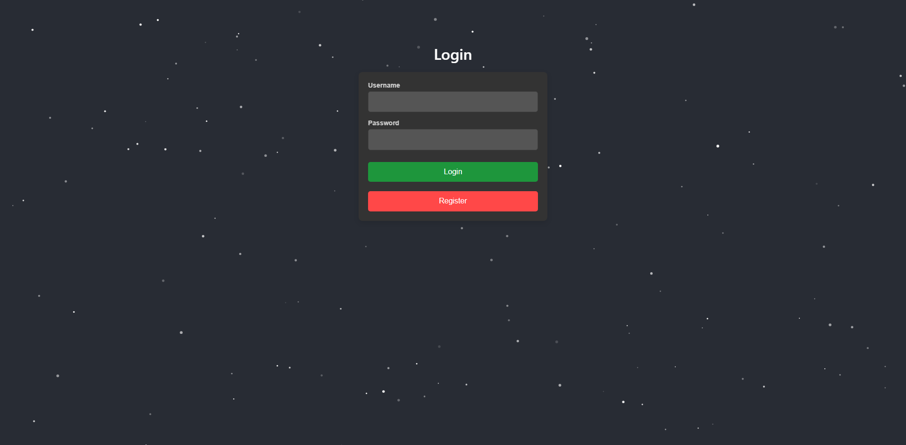
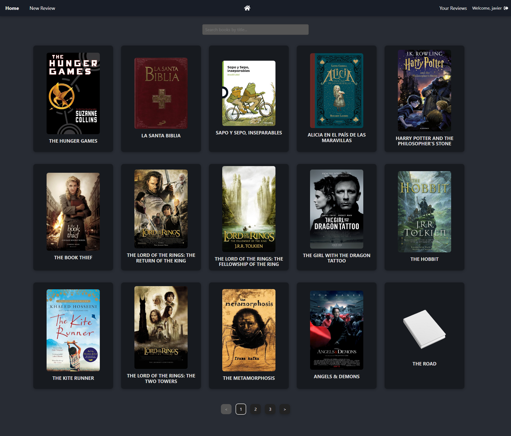
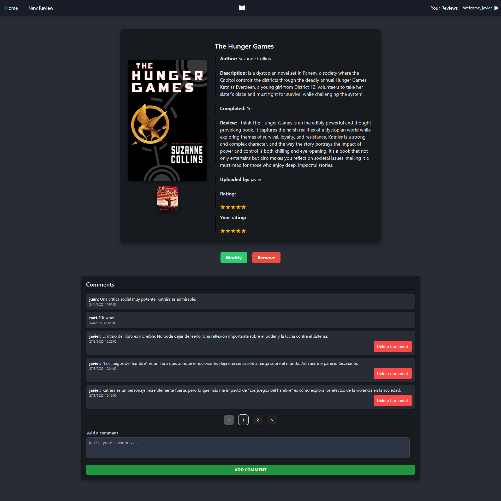
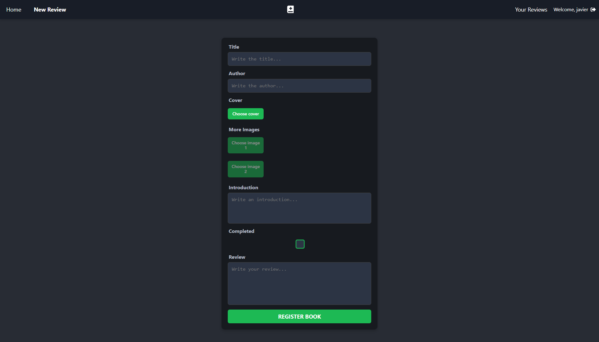

# 📚 Library Reviews

**Library Reviews** es una plataforma web donde los usuarios pueden registrarse, iniciar sesión, subir reseñas de libros, ver las opiniones de otros, y valorar sus lecturas favoritas.

---

## 🌐 Demo

🔗 [https://libraryreviews.vercel.app](https://libraryreviews.vercel.app)

---

## 🚀 Características

- Registro e inicio de sesión con verificación por correo electrónico.
- Publicación de reseñas con título, autor, descripción e imágenes.
- Valoración de libros por puntuación.
- Comentarios en libros.
- Búsqueda y filtrado de libros.
- Fondo interactivo con partículas.
- Backend con Node.js y MySQL.

---

## 🧰 Tecnologías utilizadas

### Frontend

- React
- Tailwind CSS
- tsParticles
- Vercel (hosting)

### Backend

- Node.js + Express
- MySQL
- Multer (para imágenes)
- Nodemailer (verificación de email)
- bcryptjs (encriptación de contraseñas)

---

## 🚀 Capturas

- Login

- Home

- Review

- Create

---

## 📩 Contacto

🖥️ Desarrollado por Javier López Padilla
📧 lopezpadillaj03@gmail.com
📍 Úbeda, Jaén - España